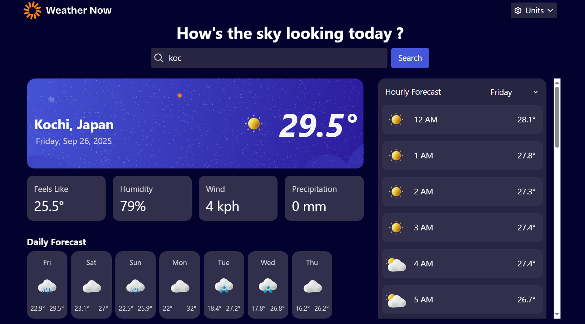
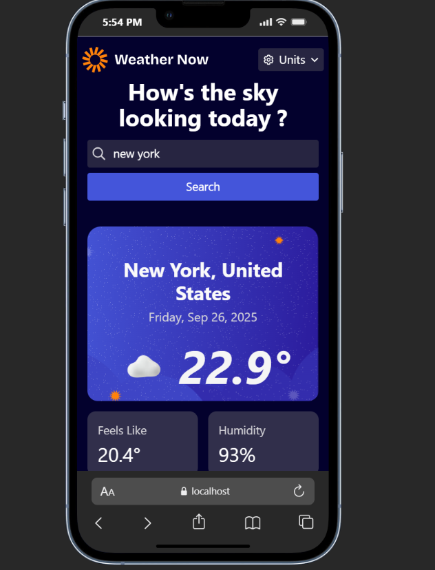

# Frontend Mentor - Weather app solution

This is a solution to the [Weather app challenge on Frontend Mentor](https://www.frontendmentor.io/challenges/weather-app-K1FhddVm49).

## Table of contents

- [Objectives](#objectives)
  - [Screenshot](#screenshot)
  - [Links](#links)
- [My process](#my-process)
  - [Built with](#built-with)
  - [What I learned](#what-i-learned)
  - [Continued development](#continued-development)
- [Author](#author)

### Objectives

Users should be able to:

- Search for weather information by entering a location in the search bar
- View current weather conditions including temperature, weather icon, and location details
- See additional weather metrics like "feels like" temperature, humidity percentage, wind speed, and precipitation amounts
- Browse a 7-day weather forecast with daily high/low temperatures and weather icons
- View an hourly forecast showing temperature changes throughout the day
- Switch between different days of the week using the day selector in the hourly forecast section
- Toggle between Imperial and Metric measurement units via the units dropdown
- Switch between specific temperature units (Celsius and Fahrenheit) and measurement units for wind speed (km/h and mph) and precipitation (millimeters) via the units dropdown
- View the optimal layout for the interface depending on their device's screen size
- See hover and focus states for all interactive elements on the page

### Screenshots

### Links

- Solution URL: [Add solution URL here](https://your-solution-url.com)
- Live Site URL: [Add live site URL here](https://your-live-site-url.com)

## My process

I started out with the header and then tried to get the api up and running.
Handling the API had a bunch of iterations and i am happy with it currently.

### Built with

- Semantic HTML5 markup
- CSS custom properties
- Flexbox
- Mobile-first workflow
- TypeScript
- Custom Hooks
- [React](https://reactjs.org/) - JS library
- [TailwindCSS]- For styles
- Vite - Build Tool
- Netlify - Hosting server

### What I learned

Usage of custom hooks to reduce the complexity and provide structure to the code.
Context API was helpful in gaining access to switch units all across the app.

### Continued development

- Add tests with React Testing Library
- Add voice input support
- Add caching and debouncing to reduce API calls.

## Author

- Website - [Joyce Thomas M]([https://joyce-ship-it-dev-portfolio.netlify.app/])
- Frontend Mentor - [@joyce-ship-it](https://www.frontendmentor.io/profile/joyce-ship-it)
- Twitter - [@SWEfromgotham](https://www.twitter.com/SWEfromgotham)
